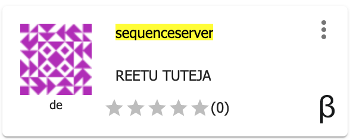
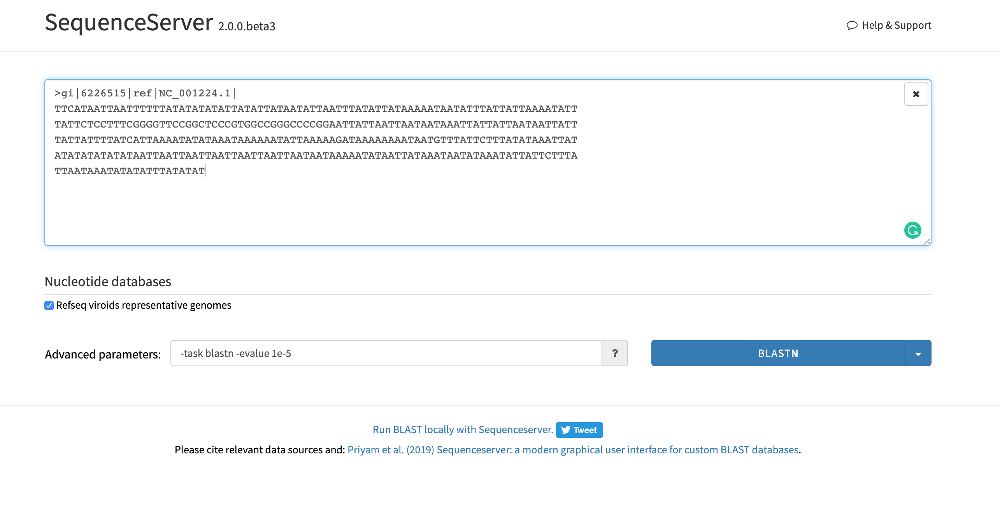

.. include:: cyverse_rst_defined_substitutions.txt

|CyVerse_logo|_

|Home_Icon|_
`Learning Center Home <http://learning.cyverse.org/>`_

**SequenceServer VICE application in DE**
==================================

Uses SequenceServer 2.0

.. raw:: html

   
<iframe src="https://www.loom.com/embed/aac933be1c2d45b7ba504870915de1d7" frameborder="0" webkitallowfullscreen mozallowfullscreen allowfullscreen style="position: absolute; top: 0; left: 0; width: 100%; height: 100%;"></iframe>

The tutorial guides you how to use SequenceServer VICE app in discovery enviornment. Custom Blast databases can be created using Create BLAST database app.

---------------------

About SequenceServer
---------------------
    
`Sequenceserver <https://sequenceserver.com/>`_ is a modern graphical interface for BLAST designed to increase the productivity of biologist researchers performing and interpreting BLAST searches (Priyam et al., 2015).

- Smart user interface automagically figures out the appropriate BLAST method for the given query and selected 
  databases.
- Detects sequence type of FASTA files and prompts to turn them into BLAST databases.
- Graphical overview of results naturally separates strong from weak hits (by evalue).
- GenBank style visualisation of hit sequences - residues grouped in multiples of five.
- Download hit sequences in FASTA format, and alignment data in tab-delimited and XML format for further 
  analysis.

---------------------------------------------------

*Launch SequenceServer with the default database*
---------------------------------------------------

.. Note:: 

.. Comment: Right-Click the below button and open in a new tab for quick launch of SequenceServer analysis with test database

            |sequenceserver|_

1. Login to the |discovery_enviornment|.

2. CLick on "Apps" tab in the Discovery Enviornment and search for "SequenceServer".

3. Click on the app icon.

|sequenceserver_app_icon|_

4. Change the name of the analysis and output folder as needed or leave for defaults.

5. Under "Input" leave the default database or browse through the datastore and change the path to a custom database. Change the number of CPUs as per requirement.

6. Under "Resource Requirements" request resources as needed or leave for defaults 

7. Click **Launch Analysis**. You will receive a notification that the job has been submitted and running. Click on 'Access your analysis here' link.

8. Once the analysis is launched, you will see the SequenceServer user interface. Input your query sequences and click Blast.

|sequenceserver_input|_

-------------

Prerequisites
-------------

Downloads, access, and services
~~~~~~~~~~~~~~~~~~~~~~~~~~~~~~~

*In order to complete this tutorial you will need access to the following services/software*

.. list-table::
    :header-rows: 1

    * - Prerequisite
      - Preparation/Notes
      - Link/Download
    * - CyVerse account
      - You will need a CyVerse account to complete this exercise
      - |CyVerse User Portal|

Platform(s)
~~~~~~~~~~~

*We will use the following CyVerse platform(s):*

.. list-table::
    :header-rows: 1

    * - Platform
      - Interface
      - Link
      - Platform Documentation
      - Quick Start
    * - Data Store
      - GUI/Command line
      - |Data Store|
      - |Data Store Manual|
      - |Data Store Guide|
    * - Discovery Environment
      - Web/Point-and-click
      - |Discovery Environment|
      - |DE Manual|
      - |Discovery Environment Guide|

Application(s) used
~~~~~~~~~~~~~~~~~~~

**Discovery Environment App(s):**

.. list-table::
    :header-rows: 1

    * - App name
      - Version
      - Description
      - App link
      - Notes/other links
    * - Create BLAST database
      - 2.6.0
      - Make BLAST database
      -	|DE Application URL|
      - |Original App Documentation|

Input and example data
~~~~~~~~~~~~~~~~~~~~~~

*In order to complete this tutorial you will need to have the following inputs prepared*

.. list-table::
    :header-rows: 1

    * - Input File(s)
      - Format
      - Preparation/Notes
      - Example Data
    * - BLAST Database
      - BLAST Database
      - A default database is already provided with the app. Browse through the data store to use any custom database for the app.
      - Reference viroids nucleotide database (iplantcollaborative > example_data > sequenceserver > db)

----

**References**

Priyam A, Woodcroft BJ, Rai V, Munagala A, Moghul I, Ter F, Gibbins MA, Moon H, Leonard G, Rumpf W & Wurm Y. 2015. Sequenceserver: a modern graphical user interface for custom BLAST databases. biorxiv doi: 10.1101/033142.

----

----

**Fix or improve this documentation**

- Search for an answer:
  |CyVerse Learning Center|
- Ask us for help:
  click |Intercom| on the lower right-hand side of the page
- Report an issue or submit a change:
  |Github Repo Link|
- Send feedback: `Tutorials@CyVerse.org <Tutorials@CyVerse.org>`_

----

|Home_Icon|_
`Learning Center Home <http://learning.cyverse.org/>`__

.. |sequenceserver| image:: https://de.cyverse.org/Powered-By-CyVerse-blue.svg
.. _sequenceserver: https://de.cyverse.org/de/?type=quick-launch&quick-launch-id=fb5c8443-0c65-46da-ba1b-dc21938a097c&app-id=ab404686-ff20-11e9-a09c-008cfa5ae621

.. Comment: Place Images Below This Line
   use :width: to give a desired width for your image
   use :height: to give a desired height for your image
   replace the image name/location and URL if hyperlinked

 .. |Clickable hyperlinked image| image:: ./img/IMAGENAME.png
    :width: 500
    :height: 100
 .. _CyVerse logo: http://learning.cyverse.org/

 .. |Static image| image:: ./img/cyverse_cmyk.png
    :width: 25
    :height: 25

.. Comment: Place URLS Below This Line

   # Use this example to ensure that links open in new tabs, avoiding
   # forcing users to leave the document, and making it easy to update links
   # In a single place in this document

   .. |Substitution| raw:: html # Place this anywhere in the text you want a hyperlink

      <a href="REPLACE_THIS_WITH_URL" target="blank">Replace_with_text</a>

.. |Github Repo Link|  raw:: html

   <a href="FIX_FIX_FIX_FIX_FIX_FIX_FIX_FIX_FIX_FIX_FIX_FIX_FIX_FIX_FIX" target="blank">Github Repo Link</a>

.. |Download Cyberduck| raw:: html

   <a href="https://cyberduck.io/" target="blank">Download Cyberduck</a>

.. |DE Application URL|  raw:: html

   <a href="https://de.cyverse.org/de/?type=apps&app-id=decdd668-5616-11e7-9724-008cfa5ae621&system-id=de" target="blank">DE Application URL</a>

.. |Original App Documentation|  raw:: html

   <a href="https://wiki.cyverse.org/wiki/pages/viewpage.action?pageId=35783313" target="blank">Original App Documentation</a>

.. |Atmosphere Image|  raw:: html

   <a href="https://atmo.cyverse.org/application/images/1384" target="blank">Atmosphere Image</a>

.. _sequenceserver_app_icon: http://learning.cyverse.org/

.. _sequenceserver_input: http://learning.cyverse.org/

.. |discovery_enviornment| raw:: html

    <a href="https://de.cyverse.org/de/" target="_blank">Discovery Environment</a>
